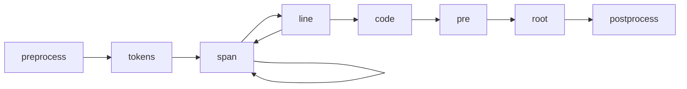

# 트랜스포머

Shiki는 HTML을 처리하고 생성하기 위해 [`hast`](https://github.com/syntax-tree/hast), 즉 HTML을 위한 AST 포맷을 사용합니다.

`hast` 트리를 조작하여 생성된 HTML을 사용자 정의하기 위해 고유한 `transformers`를 제공할 수 있습니다. 서로 다른 유형의 노드를 처리하기 위해 트리를 수정하는 함수들을 전달할 수 있습니다. 예를 들어:

```ts twoslash
import { codeToHtml } from 'shiki'

const code = await codeToHtml('foo\bar', {
  lang: 'js',
  theme: 'vitesse-light',
  transformers: [
    {
      code(node) {
        this.addClassToHast(node, 'language-js')
      },
      line(node, line) {
        node.properties['data-line'] = line
        if ([1, 3, 4].includes(line))
          this.addClassToHast(node, 'highlight')
      },
      span(node, line, col) {
        node.properties['data-token'] = `token:${line}:${col}`
      },
    },
  ]
})
```

일반적으로 사용할 수 있는 몇 가지 트랜스포머도 제공됩니다. 자세한 내용은 [`@shikijs/transforms`](/packages/transformers)를 참조하세요.

## 트랜스포머 훅



- `preprocess` - 코드가 토큰화되기 전에 호출됩니다. 토큰화 전에 코드를 수정하는 데 사용할 수 있습니다.
- `tokens` - 코드가 토큰화된 후 호출됩니다. 토큰을 수정하는 데 사용할 수 있습니다.
- `span` - 각 토큰에 대해 `<span>` 태그가 호출됩니다.
- `line` - 각 줄 `<span>` 태그에 대해 호출됩니다.
- `code` - 모든 줄을 감싸는 각 `<code>` 태그에 대해 호출됩니다.
- `pre` - `<code>` 태그를 감싸는 각 `<pre>` 태그에 대해 호출됩니다.
- `root` - HAST 트리의 루트로, 일반적으로 하나의 자식 `<pre>` 태그만 포함합니다.
- `postprocess` - HTML이 생성된 후 호출되며, 최종 출력을 수정할 기회를 제공합니다. `codeToHast`에서는 호출되지 않습니다.

## 메타

트랜스포머는 [지원되는 통합](/ko/guide/install#integrations)에서 마크다운 'meta' 문자열에도 접근할 수 있습니다.

````markdown
<!-- [!code word:meta=here] -->

```html meta=here

```
````

다음과 같이 원시 메타에 접근할 수 있습니다:

```ts
options.meta
// => { meta: 'here', __raw: 'meta=here' }
```

```

```
